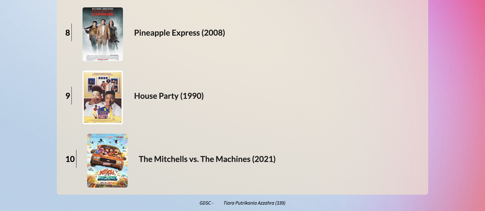
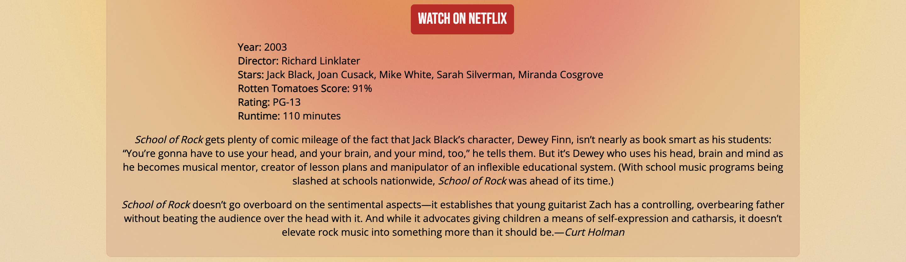
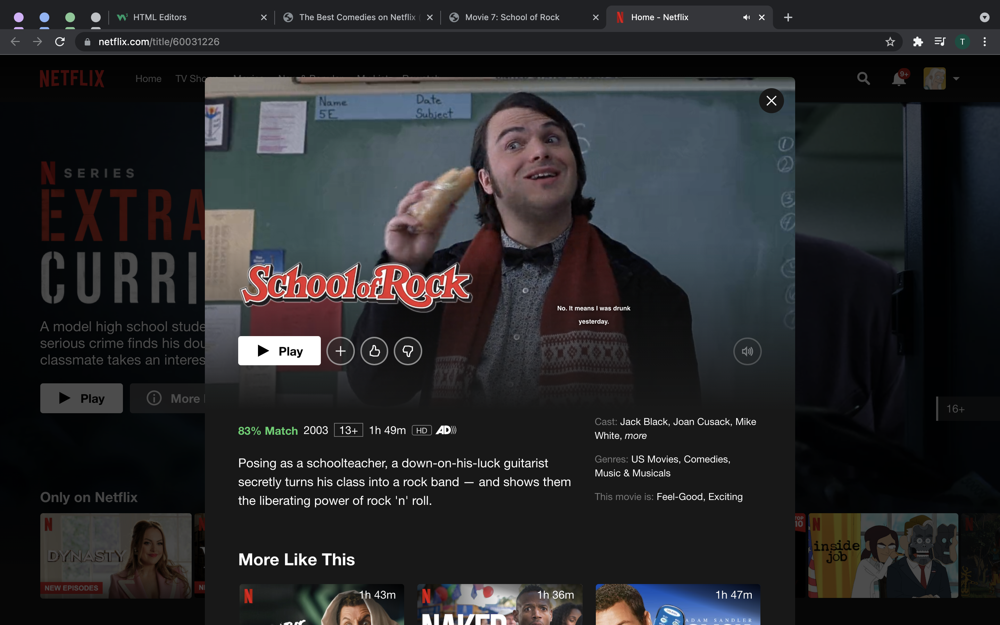
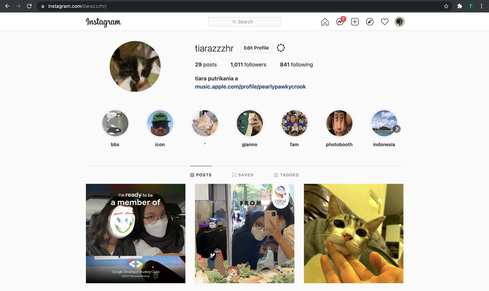

Tugas Frontend 1 GDSC ITB
oleh Tiara Putrikania Azzahra (ID:339)

Website yang saya buat ini menampilkan urutan 10 film komedi terbaik yang ada di Netflix (per Oktober 2021) berdasarkan laman pastemagazime.com. Website ini dilengkapi fitur search bar untuk mencari judul film yang tertera pada website. Selain itu, apabila judul film pada laman utama di klik, user akan diarahkan ke laman page baru yang menampilkan identitas, rating, dan deskripsi film, serta menyediakan tombol yang langsung mengarahkan user menuju laman Netflix film tersebut.

Untuk membuka website, kunjungi melalui : [The Best Comedies on Netflix (October 2021)](https://azzahratiarapu.github.io/home.html)

Berikut tampilan halaman utama website saya:

Berikut tampilan penggunaan fitur search bar

Berikut tampilan salah satu halaman detail film

Jika tombol "WATCH ON NETFLIX" diklik, user akan diarahkan ke halaman Netflix film tersebut seperti di bawah ini

Selain itu, jika Kakak-Kakak klik nama saya yang ada di bawah halaman utama website seperti di bawah ini

, Kakak-Kakak akan diarahkan ke halaman akun instagram saya, mutualan yu Kak hehe 😬🙏

Terimakasih Kak sebelumnya, tugasnya sangat membantu!
